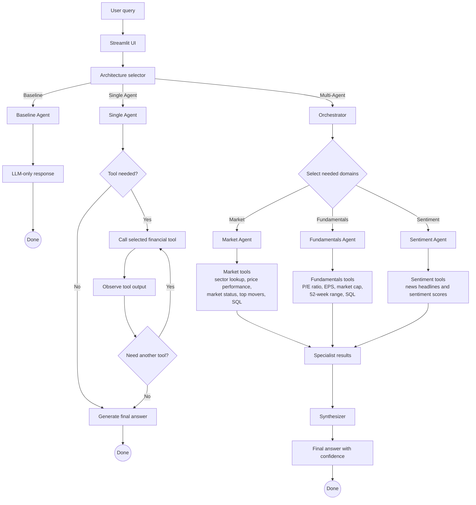

# FinTech AI Agent - Stock Analysis Workflow

This repository contains a financial question-answering system powered by Large Language Models (LLMs). It explores three distinct architectural patterns: **Baseline**, **Single Agent**, and **Multi-Agent**. The system leverages external APIs (like `yfinance`) and a local SQL database to fetch real-time financial data, company fundamentals, and news sentiment.

---

## 🏗️ AI Agent Architectures

### 1. Baseline Agent
A standard LLM that answers user queries directly based on its internal knowledge. It has no access to real-time market data or external tools. It serves as a control for performance evaluation.

### 2. Single Agent
An autonomous LLM agent equipped with **all 7 financial tools**. The agent uses function calling to interact with tools, analyzes the response, and determines if it has enough information to construct a final answer. It is capable of executing up to 10 iterations of tool usage.

### 3. Multi-Agent System (Parallel Specialists)
The most advanced architecture, designed to optimize latency and accuracy by delegating tasks to domain-specific specialist agents running in parallel.

#### Multi-Agent Workflow Components:
1. **Orchestrator**: Analyzes the user's prompt and routes it to the necessary domain specialists (`Market`, `Fundamentals`, `Sentiment`).
2. **Specialist Agents** (Running in Parallel):
   - **Market Agent**: Focuses on sector lookups, price performance, top market movers, and general market status.
   - **Fundamentals Agent**: Retrieves core company metrics (P/E ratio, EPS, Market Cap, 52-week highs/lows).
   - **Sentiment Agent**: Fetches the latest news and calculates sentiment scores (Bullish, Bearish, Neutral).
3. **Synthesizer**: A final LLM pass that aggregates the outputs from the specialists into a single, cohesive response, preserving critical numerical data and reporting overall confidence.

---

## 📊 Available Tools

| Tool | Source | Description |
| :--- | :--- | :--- |
| `get_tickers_by_sector` | Local SQLite DB | Retrieves all stock tickers within a specified sector or industry. |
| `get_price_performance` | `yfinance` | Calculates percentage price change over selected periods (1mo, 3mo, 1y, etc.). |
| `get_company_overview` | `yfinance` | Returns stock fundamentals (P/E, EPS, Market Cap, 52-week range). |
| `get_market_status` | `datetime` logic | Checks if US Equity markets are currently open or closed. |
| `get_top_gainers_losers`| `yfinance` | Identifies today's top gainers, losers, and most active stocks. |
| `get_news_sentiment` | `yfinance` | Gets recent headlines and calculates a Bullish/Bearish/Neutral score. |
| `query_local_db` | Local SQLite DB | Executes raw SQL `SELECT` statements against `stocks.db`. |

---

## 🗺️ Workflow Diagram

The following diagram visualizes the flow of the **Multi-Agent Architecture**, highlighting how user prompts are processed, delegated, and ultimately synthesized.



---

## ⚙️ How to Run

1. **Install Dependencies**: Ensure you have `streamlit`, `yfinance`, `pandas`, and your required LLM provider client installed.
2. **Set Environment Variables**: Configure `config.py` with your active LLM model and API keys.
3. **Run the App**:
   ```bash
   streamlit run app.py
   ```
4. **Interact**: Select an architecture from the sidebar and ask financial questions (e.g., "What is the P/E ratio for AAPL and MSFT?", "Which tech stocks are the top gainers today?").
