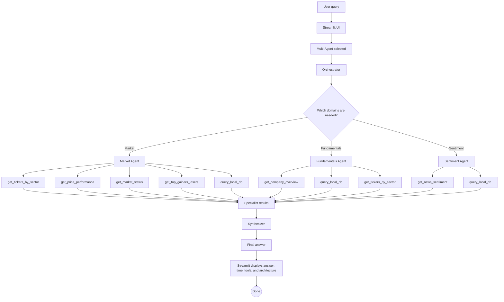
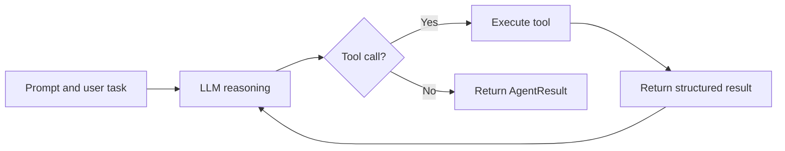

# Agentic Financial Market QA System Workflow

## Overview

This project is a financial question-answering system that compares three LLM architectures:

1. Baseline LLM
2. Single tool-using agent
3. Multi-agent system with an orchestrator, specialist agents, external tools, and a final synthesizer

The system is designed to answer stock-market questions using a combination of LLM reasoning, tool calling, live market data, news sentiment, company fundamentals, and a local SQL database.

## Core Components

### Streamlit UI

The Streamlit interface receives the user query, lets the user choose an architecture, displays the final response, and shows execution metadata such as latency, number of tools used, and selected architecture.

### Baseline Agent

The Baseline Agent answers directly using the LLM without external tools. It is mainly used as a benchmark for comparing accuracy and reliability against the tool-augmented architectures.

### Single Agent

The Single Agent uses one LLM agent with access to all available tools. It selects tools dynamically, calls them through function calling, observes the returned data, and continues iterating until it produces a final answer.

### Multi-Agent System

The Multi-Agent System uses an orchestrator to decide which specialist agents should answer the query. The selected specialists run in parallel, each with a narrower financial domain and a focused tool set.

Specialist agents include:

- Market Agent: handles sector lookup, price performance, market status, top movers, and SQL database queries.
- Fundamentals Agent: handles company overview, P/E ratio, EPS, market cap, and 52-week range.
- Sentiment Agent: handles recent news headlines and sentiment scores.

### Tool Layer

The tool layer connects agents to structured financial data sources:

- yfinance for price data, fundamentals, top movers, and news.
- SQLite database for local stock metadata.
- Function schemas that define which tools the LLM can call and what arguments each tool requires.

### Synthesizer

The Synthesizer combines all specialist outputs into one final response. It preserves specific numbers, tickers, dates, tool results, and partial data instead of discarding incomplete but useful information.

## Workflow Diagram

```mermaid
graph TD
    %% Styling
    classDef userNode fill:#4a90e2,stroke:#fff,stroke-width:2px,color:#fff;
    classDef systemNode fill:#2c3e50,stroke:#fff,stroke-width:2px,color:#fff;
    classDef agentNode fill:#e67e22,stroke:#fff,stroke-width:2px,color:#fff;
    classDef toolNode fill:#27ae60,stroke:#fff,stroke-width:2px,color:#fff;
    classDef outputNode fill:#8e44ad,stroke:#fff,stroke-width:2px,color:#fff;

    %% Nodes
    A([User Input Prompt]) ::: userNode
    B[Streamlit UI] ::: systemNode
    C{Orchestrator LLM} ::: agentNode

    %% Specialists
    D[Market Specialist] ::: agentNode
    E[Fundamentals Specialist] ::: agentNode
    F[Sentiment Specialist] ::: agentNode

    %% Tools
    T1[(SQLite DB)] ::: toolNode
    T2[yfinance API] ::: toolNode

    %% Synthesizer
    G[Synthesizer LLM] ::: agentNode
    H([Final Formatted Answer]) ::: outputNode

    %% Flow
    A --> B
    B -->|Selects Multi-Agent| C
    
    C -->|Routes to Domains| D
    C -->|Routes to Domains| E
    C -->|Routes to Domains| F
    
    %% Market Tool Connections
    D -.->|get_market_status| T2
    D -.->|get_price_performance| T2
    D -.->|get_top_gainers_losers| T2
    D -.->|query_local_db| T1
    D -.->|get_tickers_by_sector| T1

    %% Fundamentals Tool Connections
    E -.->|get_company_overview| T2
    E -.->|get_tickers_by_sector| T1
    E -.->|query_local_db| T1

    %% Sentiment Tool Connections
    F -.->|get_news_sentiment| T2
    F -.->|query_local_db| T1

    %% Synthesis
    D ==>|Market Context| G
    E ==>|Fundamentals Context| G
    F ==>|Sentiment Context| G
    
    G --> H
```

## Detailed Multi-Agent Flow



## Agent Execution Pattern

Each tool-using agent follows the same loop:



## Why This Architecture Improves the System

The Baseline Agent is simple but cannot access fresh or structured financial data. The Single Agent improves grounding by using tools, but it must handle all financial reasoning in one broad prompt. The Multi-Agent System improves reliability by separating the task into domain-specific agents and letting each specialist focus on a narrower set of tools and rules.

This design supports the resume claims that the project improved query accuracy by comparing baseline, single-agent, and multi-agent architectures, reduced latency through agent orchestration and tool selection, and used a RAG-style architecture that integrates OpenAI GPT models, external APIs, and a local SQL database.

## Tool Summary

| Tool | Purpose |
|---|---|
| get_tickers_by_sector | Finds stocks by sector or industry from the local database |
| get_price_performance | Calculates stock price change over a selected time period |
| get_company_overview | Retrieves P/E ratio, EPS, market cap, and 52-week range |
| get_market_status | Checks whether major U.S. exchanges are open or closed |
| get_top_gainers_losers | Returns top gainers, losers, and active stocks |
| get_news_sentiment | Retrieves recent headlines and sentiment scores |
| query_local_db | Runs SELECT queries against the local SQLite stock database |

## Suggested Resume Description

Built an agentic financial question-answering system comparing baseline, single-agent, and multi-agent LLM architectures. Designed an orchestrator that routes user queries to Market, Fundamentals, and Sentiment specialists, each connected to financial tools backed by yfinance and a local SQLite database. Combined specialist outputs with a final synthesizer to improve answer quality, preserve numerical evidence, and reduce unnecessary LLM/API calls.